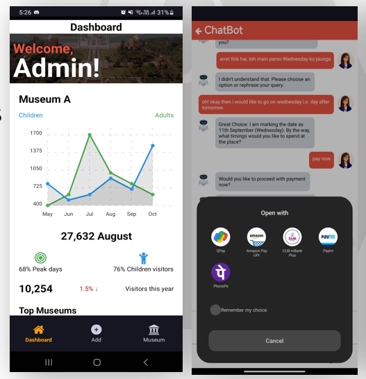

# Book My Ticket

**Book My Ticket** is a mobile application that allows users to browse events, select seats, and book tickets online. The platform is designed to streamline the ticket booking process, offering an easy-to-navigate interface and seamless payment integration.


## Features


- **Multilingual**: Users can explore and book tickets for various museum events, ensuring accessibility across multiple languages for a diverse audience.

- **User Authentication**: Secure login and registration functionality.


- **Payment Gateway DeepLinking**: Supports secure payment methods via Deep linking upi apps for easy ticket purchase.

- **Analytics**: Admins can add, edit, and manage events, seat arrangements, and ticket prices.
  

- **Exploring Events**: Users can browse through available events in museums, view event details, and select tickets. After booking, they can access their booking history and download e-tickets for easy reference.

  
  
## Technologies Used

- **Frontend**: React Native, Tailwind CSS
- **Backend**: Flask
- **Database**: Supabase
- **Payment Integration**: Deep Linking UPI apps
- **Authentication**: Custom session token authentication
- **Deployment**: Vercel, Supabase, Render

## Installation

1. Clone the repository:
   ```bash
   git clone https://github.com/ShaliniSJ/book-my-ticket.git
